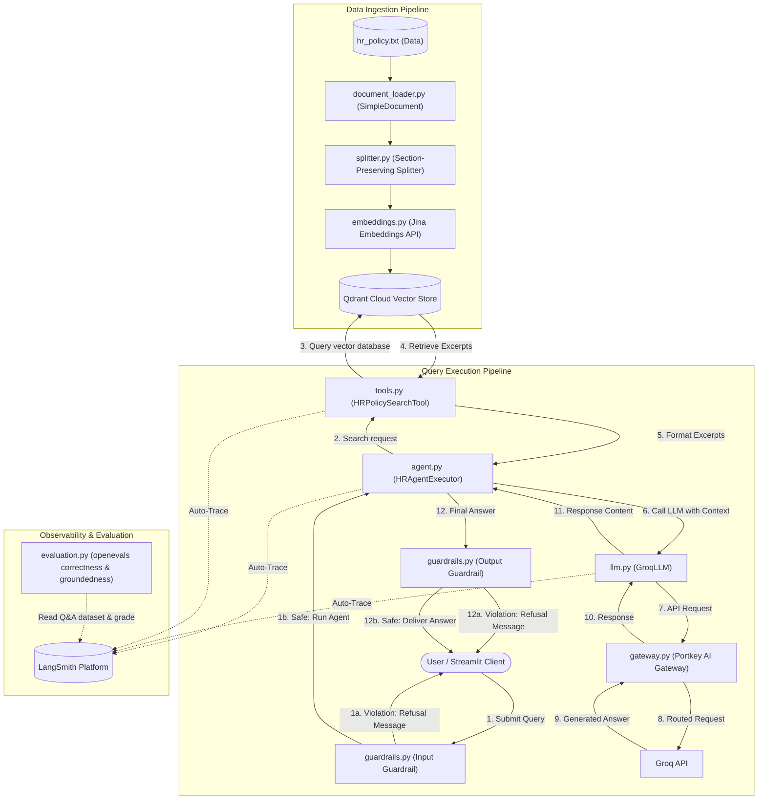

# Acme Corp HR Policy Assistant Architecture

This document details the architectural design and system workflows of the Acme Corp HR Policy Assistant. The application follows a Retrieval-Augmented Generation (RAG) pattern, fortified with multi-stage LLM-based safety guardrails and robust API gateway routing.

---

## High-Level Architecture Diagram

The diagram below shows the flow of data during ingestion (blue path) and during user query execution (green/red path):

---

## Core Components

### 1. Ingestion & Preprocessing
* **Document Loader ([`document_loader.py`](file:///c:/Users/sahil/New%20folder%20%284%29/HR%20Policy%20Assistant/hr_assistant/document_loader.py))**: Reads the raw text HR policy document (`hr_policy.txt`) and wraps the file contents in a `SimpleDocument` object along with source metadata.
* **Section-Preserving Splitter ([`splitter.py`](file:///c:/Users/sahil/New%20folder%20%284%29/HR%20Policy%20Assistant/hr_assistant/splitter.py))**: 
  - Splits text files using regular expressions that identify standard markdown headings and numerical sections (e.g., `1. INTRODUCTION` or `### Work From Home Policy`).
  - Groups paragraph blocks under these section titles.
  - Generates chunks up to 500 characters, prepend-tagging each chunk with its relevant section heading (e.g., `[Work From Home Policy]\nParagraph content...`) to ensure semantic search retains structural context.

### 2. Embeddings & Vector Store
* **Embeddings ([`embeddings.py`](file:///c:/Users/sahil/New%20folder%20%284%29/HR%20Policy%20Assistant/hr_assistant/embeddings.py))**: Implements a custom subclass of LangChain's `Embeddings` base class, connecting directly to the **Jina AI Embeddings API** using the model `"jina-embeddings-v2-base-en"`.
* **Vector Store ([`vector_store.py`](file:///c:/Users/sahil/New%20folder%20%284%29/HR%20Policy%20Assistant/hr_assistant/vector_store.py))**: Integrates with **Qdrant Cloud** via `langchain_qdrant`.
  - **Connection reuse**: Checks if the target collection already exists on Qdrant Cloud (`vector_store_exists()`). If present, it establishes a connection instantly without re-embedding the document, saving time and API costs.
  - **Index creation**: If no collection is present, it embeds the split chunks and uploads them.
  - **Retriever**: Serves top-k (default `k=3`) closest chunks based on cosine similarity.

### 3. RAG Agent Executor ([`agent.py`](file:///c:/Users/sahil/New%20folder%20%284%29/HR%20Policy%20Assistant/hr_assistant/agent.py))
Instead of using standard heavy-weight LangGraph architectures, the codebase implements a lean `HRAgentExecutor`:
1. It takes a user query and runs it through the search tool (`HRPolicySearchTool`).
2. It structures a multi-turn message payload with:
   - A system prompt instructing the agent to act as the official Acme Corp HR assistant, answer *only* using the provided policy excerpts, omit citation tags/section numbers, and reply politely to basic greetings.
   - A user prompt merging the retrieved policy excerpts and the original question.
3. It sends this payload to the custom LLM client and returns the answer in a structure compatible with standard LangChain inputs/outputs.

### 4. Custom Fallback LLM Client ([`llm.py`](file:///c:/Users/sahil/New%20folder%20%284%29/HR%20Policy%20Assistant/hr_assistant/llm.py))
To prevent application failures due to API key issues, model deprecation, or rate limiting on Groq, the `GroqLLM` wrapper implements a model fallback mechanism:
- It maintains an ordered list of fallback models: `[config.LLM_MODEL_NAME, "groq/compound", "groq/compound-mini", "qwen/qwen3.6-27b"]`.
- If the primary model fails or returns a non-200 status code, the client automatically cycles through the remaining models sequentially within the same API request loop.

### 5. Multi-Stage Safety Guardrails ([`guardrails.py`](file:///c:/Users/sahil/New%20folder%20%284%29/HR%20Policy%20Assistant/hr_assistant/guardrails.py))
To ensure compliance and security, the system executes validation checks using a specialized guard model (`openai/gpt-oss-safeguard-20b`) before and after agent execution:
- **Input Guardrail (`check_input`)**: Checks the question against prompt injection attempts or requests for confidential information of other named employees.
- **Output Guardrail (`check_output`)**: Inspects the generated response for leaks of personally identifiable information (PII), unauthorized policy promises (e.g. approving leaves), toxic comments, or suspicious URL links.
- **Violation Handing**: If either guardrail detects a violation, the workflow is interrupted immediately, and a standard message is shown: *"Sorry, I can't help with that request."*

### 6. Portkey LLM Gateway ([`gateway.py`](file:///c:/Users/sahil/New%20folder%20%284%29/HR%20Policy%20Assistant/hr_assistant/gateway.py))
All LLM queries (including the agent's main queries, the guardrail safety model, and the evaluation judge model) route through the **Portkey AI Gateway**.
- This hides raw API keys behind tenant provider aliases (e.g. `@hrpolicy`).
- To navigate restrictions on workspace-level configuration inline blocks, routing targets a single provider alias via custom HTTP headers.

### 7. Observability & Evaluation ([`evaluation.py`](file:///c:/Users/sahil/New%20folder%20%284%29/HR%20Policy%20Assistant/hr_assistant/evaluation.py))
- **LangSmith Tracing**: Tracing variables are configured at start time. When enabled, LangChain and Portkey automatically log execution pathways, tools metadata, token counts, and completion response times.
- **LLM-as-a-Judge Evaluation**: Scores the agent output using a separate judge model (`openai/gpt-oss-20b` via Portkey) against 10 ground-truth Q&A test cases:
  - **Correctness Evaluator**: Checks the accuracy of the generated answer compared to the reference ground truth.
  - **Groundedness Evaluator**: Computes if the generated answer is strictly grounded in the context chunks fetched from the vector database, identifying hallucinations.
